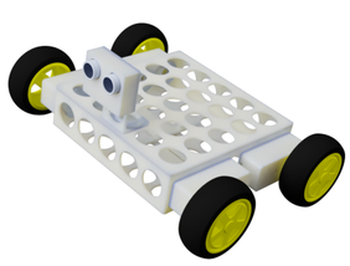
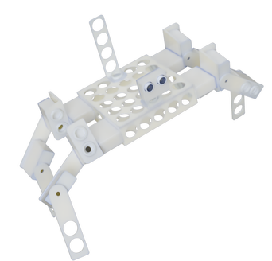
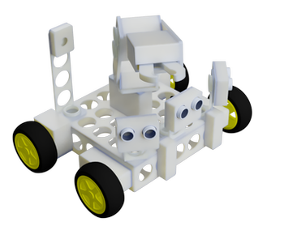

# :rocket: GSOC 2019 - A DIY robot kit for educators 

## Introduction
___
With that project I will design an easy to assembly and program robot. The designs will be 3D printable and
all the electronics parts will be easy to find in any electronic equipment store. I will use the Raspberry Pi 3+ as main computer with Rasbian operating system combined with Jupyter Notebook as interface.

## So far
___
The Phase 1 of the project completed and the Proteas modular robot borned. Proteas robot is have a high modular design 
with the capability to re-arrange the components with many ways. 

Three of many possible modes of the robot.
## :trophy: Project goals 
___
The main goal of the project is to provide an easy to use tool for the educators community as alternative to expensive commercial kits. The same time that project gives the opportunity to everyone to create a robot at home. 

## :calendar: Timeline
___
The implementation details follow, organized by [GSoC timeline](https://developers.google.com/open-source/gsoc/timeline).

## Community Bonding Period (May 6 - May 26)
___
I will start to create some draft designs of the robot and the same time i will make the needed research for all the stages of my project.

## Phase 1 (May 27 - Jun 28)
___
I will choose the proper electronic parts for that project and I will design and print the 3D parts of the robot in a 
modular way with a tool-less philosophy. 

- Selection of electronic parts
- 3D designs :triangular_ruler:
- Parts printing stage
- Functionality tests of the parts
- Robot Assembly :wrench:

## Phase 2 (Jun 29 - Jul 26)
___
I will create new libraries for the communication between hardware-software. At the same time I will integrate already available libraries (e.x. integration with Jupyter notebook for easy programming). 

- Movement library
- Sensing library
- OpenCV integration
- Special control and functionality library (e.x. PID Controller)
- Jupyter Notebook integration

## Phase 3 (Jul 27 - Aug 26)
___
Finally I will make all the needed preparation for easy deployment of software, material for the courses, user manuals and instructions.

- Modifications of Rasbian image
- Courses on Jupyter Notebook (e.x. Line Follower robot)
- PDFs with extensive instructions for the assembly and usage of the robot
- Final debugging

:package: The whole project will be packaged in a modified image of Rasbian OS, also the new libraries will be available in PYPI and the designs will be available in that repository.

 The 3D designs, educational material and text is licensed under a <a rel="license" href="http://creativecommons.org/licenses/by-sa/4.0/">Creative Commons Attribution-ShareAlike 4.0 International License</a>.
